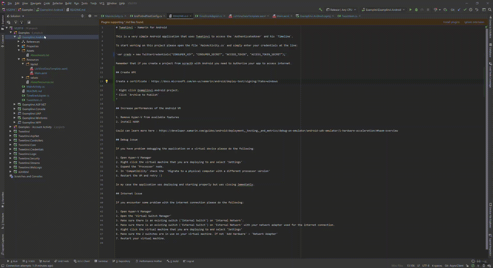

# Tweetinvi - Xamarin for Android

This is a very simple Android application that uses Tweetinvi to access the `AuthenticatedUser` and his `Timeline`.

To start working on this project please open the file `MainActivity.cs` and simply enter your credentials at the line:

`var creds = new TwitterCredentials("CONSUMER_KEY", "CONSUMER_SECRET", "ACCESS_TOKEN", "ACCESS_TOKEN_SECRET");`

Remember that if you create a project from scracth with Android you need to Authorize your app to access internet.

## Create APK

Create a certificate : https://docs.microsoft.com/en-us/xamarin/android/deploy-test/signing/?tabs=windows

* Right click Examplinvi.Android project.
* Click `Archive to Publish`
* Select your archive
* Select Certificate
* Publish Apk
* Show Apk File
* Install apk into virtual machine 
* Run (app is slow to start - 20 secs of white page)

## Increase performances of the Android VM

1. Remove Hyper-V from available features
2. Install HAXM

Could can learn more here : https://developer.xamarin.com/guides/android/deployment,_testing,_and_metrics/debug-on-emulator/android-sdk-emulator/1-hardware-acceleration/#haxm-overview

## Debug issue

If you have problem debugging the application on a virtual device please do the following:

1. Open Hyper-V Manager
2. Right click the virtual machine that you are deploying to and select 'Settings'
3. Expand the 'Processor' node.
4. In 'Compatibility' check the  'Migrate to a physical computer with a different processor version'
5. Restart the VM and retry :)

In my case the application was deploying and starting properly but was closing immediatly.

## Internet issue

If you encounter some problem with the internet connection please do the following:

1. Open Hyper-V Manager
2. Open the 'Virtual Switch Manager'
3. Make sure there is an existing switch ('Internal Switch') on 'Internal Network'.
4. Make sure there is an existing switch ('External Switch') on 'External Network' with your network adapter used for the internet connection.
5. Right click the virtual machine that you are deploying to and select 'Settings'
6. Make sure the 2 switches are in use on your virtual machine. If not 'Add Hardware' > 'Network Adapter'
7. Restart your virtual machine.
