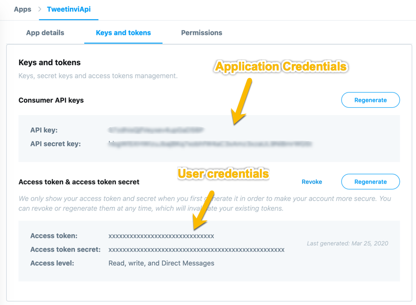

# Getting Started

In this section we will create a simple console application that will print your username.

## Pre requisites

Before starting you will need a Twitter app and a set of user credentials.\
If you already have credentials skip this section.

<details>
<summary>Steps to create my first credentials</summary>

1. Create a new application on [https://developer.twitter.com/en/apps/create](https://developer.twitter.com/en/apps/create)
2. Select the `Keys and Tokens` tab
3. Click `Generate` next to the **Access token & access token secret**
4. Now you can find your application credentials as well as the additional credentials for authenticating as a user.

<div style="max-width:700px;">



</div>

</details>

## Create a new project

``` sh
# create a new directory for the hello world application
mkdir tweetinvi-hello-world && cd tweetinvi-hello-world

# initialize a console project
dotnet new console
```


## Installation

Tweetinvi is available github and on [nuget](https://www.nuget.org/packages/TweetinviAPI/):

``` sh
dotnet add package TweetinviAPI
```

## Hello Twitter World!

Now we just need to modify the `Main` function of `Program.cs`

``` c#
static async Task Main(string[] args)
{
    var userClient = new TwitterClient("CONSUMER_KEY", "CONSUMER_SECRET", "ACCESS_TOKEN", "ACCESS_TOKEN_SECRET");
}
```

Now lets print your username!

``` c#
var user = await userClient.Users.GetAuthenticatedUserAsync();
Console.WriteLine(user);
```

And now lets inform the world about your great achievement!

``` c#
var tweet = await userClient.Tweets.PublishTweetAsync("Hello tweetinvi world!");
Console.WriteLine("You published the tweet : " + tweet);
```

**Congratulation you have finished this tutorial!**

<details>
<summary>Source code: Program.cs</summary>

``` c#
using System;
using System.Threading.Tasks;

// You need to add the tweetinvi namespace
using Tweetinvi;

namespace tweetinvi_hello_world
{
    class Program
    {
        static async Task Main(string[] args)
        {
            // we create a client with your user's credentials
            var userClient = new TwitterClient("CONSUMER_KEY", "CONSUMER_SECRET", "ACCESS_TOKEN", "ACCESS_TOKEN_SECRET");

            // request the user's information from Twitter API
            var user = await userClient.Users.GetAuthenticatedUserAsync();
            Console.WriteLine("Hello " + user);

            // publish a tweet
            var tweet = await userClient.Tweets.PublishTweetAsync("Hello tweetinvi world!");
            Console.WriteLine("You published the tweet : " + tweet);
        }
    }
}
```

</details>